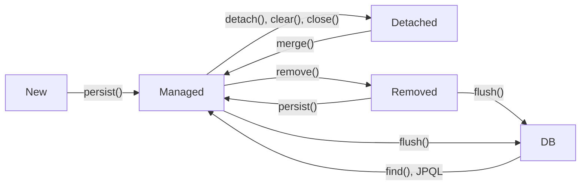

영속성 관리
===============

## 1. EntityManagerFactory, EntityManager
* EntityManagerFactory는 애플리케이션 전체에 하나만 만들어 사용해야하고   쓰레드 공유가 가능하다.
* EntityManager는 여러개 생성해도 되지만 동시 접근시 문제가 발생한다.(Critical Section)

## 2. 영속성 컨텍스트(persistence context)
* 엔티티의 생명주기
  * 비영속(new/transient) : 영속성 컨텍스트와 전혀 관계없는 상태
  <br> 애플리케이션에만 선언된 데이터
  * 영속(managed) : 영속성 컨텍스트에 저장된 상태
  <br> 애플리케이션의 데이터가 EntityManager로 관리(연결)할 수 있는 상태
  * 준영속(detached) : 영속성 컨텍스트에 저장되었다가 분리된 상태
  <br> 애플리케이션 데이터와 EntityManager의 연결을 끊은 상태로 데이터는 그대로 있음
  * 삭제(removed) : 삭제된 상태


## 3. 영속성 컨텍스트 특징
* 영속 상태에서는 반드시 식별자값(@Id)이 있어야 한다.
* 영속성 컨텍스트을 트랜잭션에 커밋하면 그때 DB에 저장된다. 이걸 flush라 한다.
* 영속성 컨텍스트가 엔티티를 관리할때 장점
  * **1차 캐시** : 영속성 켄텍스트 내부의 캐시
  <br> 데이터가 1차캐시에 있으면 DB에서 조회하지 않고 여기서 조회한다.
  * **동일성 보장**
```java
Member a = em.find(Member.class, "Member1");
Member b = em.find(Member.class, "Member1");

System.out.println(a==b); // true
```
  * **트랜잭션을 지원하는 쓰기 지연**
    * 영속성 컨텍스트 내용 변경 후 commit 전까지 쓰기 지연이 발생한다.
  * **변경 감지**
  * **지연 로딩**

## 4. flush
* flush()는 영속성 컨텍스트의 변경 내용을 데이터베이스에 반영한다.
* flush 동작 순서
  1.  변경감지가 동작해 영속성 컨텍스트에 있는 모든 엔티티를 스냅샷과 비교하여 수정된 걸 찾아 수정 쿼리를 만들어 쓰기 지연 SQL 저장소에 등록한다.
  2. 작성된 쿼리를 데이터 베이스에 전송한다.
* flush 방법
  * em.flush()를 직접 호출한다.
  * 트랜잭션 커밋시 자동 호출
  * JPQL 쿼리 실행 시 자동 호출

## 5. 준영속
* 준영속 상태에서는 영속 상태때 제공하는 기능을 이용할 수 없다.
* 준영속 상태로 전환 : em.detach(entity)
  - 준영속 상태로 전환되며 1차 캐시에서 삭제되고 쓰기 지연 SQL도 삭제한다.
* 영속성 컨텍스트 초기화 : em.clear()
  - 영속성 컨텍스트를 초기화해서 모든 엔티티를 준영속으로 만든다.
* 영속성 컨텍스트 종료 : em.close()
  - 영속성 컨텍스트가 관리하던 영속성 엔티티가 모두 준영속 상태가 된다.
* 병합: em.merge(entity)
  - 새로운 영속 상태의 엔티티를 반환한다.