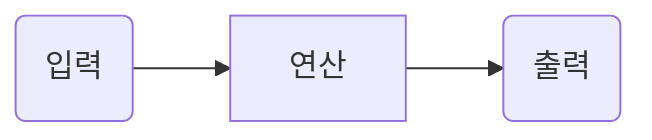

영속성 관리
===============

## 1. EntityManagerFactory, EntityManager
* EntityManagerFactory는 애플리케이션 전체에 하나만 만들어 사용해야하고   쓰레드 공유가 가능하다.
* EntityManager는 여러개 생성해도 되지만 동시 접근시 문제가 발생한다.(Critical Section)

## 2. 영속성 컨텍스트(persistence context)
* 엔티티의 생명주기
  * 비영속(new/transient) : 영속성 컨텍스트와 전혀 관계없는 상태
  * 영속(managed) : 영속성 컨텍스트에 저장된 상태
  * 준영속(detached) : 영속성 컨텍스트에 저장되었다가 분리된 상태
  * 삭제(removed) : 삭제된 상태
